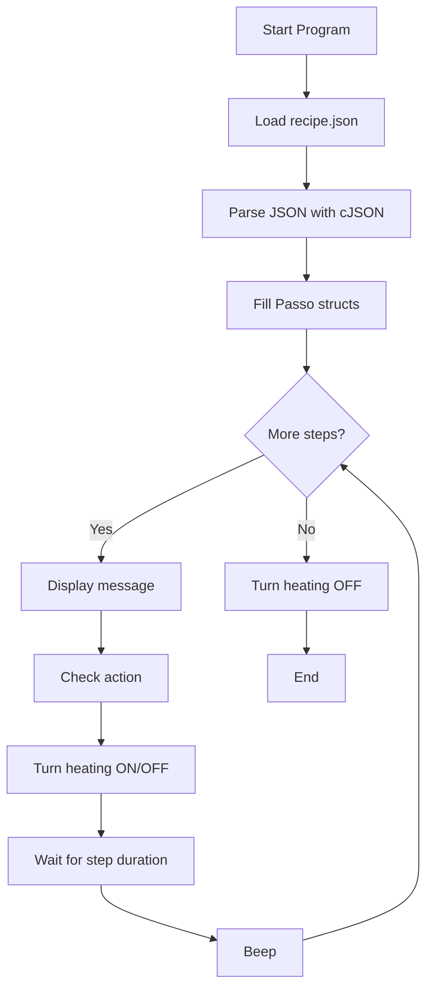

# Recipe Execution Engine (C + JSON)

This project demonstrates a simple recipe‑execution system designed for embedded‑style logic.  
A JSON file defines the recipe steps, and a C program loads and executes them using the `cJSON` library.

The system simulates the behavior of a programmable electric cooker:  
display messages, heating control, timing, and beeps.

---

## Project Structure

```
/project
│
├── recipe.json      # Recipe definition (data only)
└── main.c           # Execution engine (logic)
```

---

## Requirements

### System Requirements (Linux)

Install a C compiler and the cJSON library:

```bash
sudo apt update
sudo apt install build-essential libcjson-dev
```

### System Requirements (Windows)

Install MinGW‑w64:

```powershell
winget install -e --id Mingw.Mingw
```

Ensure `gcc` is available in your PATH.

---

## Visual Studio Code Requirements

To work with this project in Visual Studio Code, install the following extensions:

### Required Extensions
- C/C++ (Microsoft)  
  IntelliSense, syntax highlighting, debugging  
  ID: ms-vscode.cpptools

- Code Runner  
  Quick execution of C files  
  ID: formulahendry.code-runner

- JSON Tools  
  JSON formatting and validation  
  ID: eriklynd.json-tools

- Error Lens  
  Inline error highlighting  
  ID: usernamehw.errorlens

- GitLens (optional)  
  Git integration  
  ID: eamodio.gitlens

---

## VS Code Build Task

Create:

```
.vscode/tasks.json
```

With:

```json
{
  "version": "2.0.0",
  "tasks": [
    {
      "label": "build recipe",
      "type": "shell",
      "command": "gcc main.c -lcjson -o recipe",
      "group": "build",
      "problemMatcher": ["$gcc"]
    }
  ]
}
```

Build using:

```
Ctrl + Shift + B
```

---

## Debugging Setup (VS Code)

Create:

```
.vscode/launch.json
```

With:

```json
{
  "version": "0.2.0",
  "configurations": [
    {
      "name": "Debug Recipe",
      "type": "cppdbg",
      "request": "launch",
      "program": "${workspaceFolder}/recipe",
      "cwd": "${workspaceFolder}",
      "MIMode": "gdb",
      "preLaunchTask": "build recipe"
    }
  ]
}
```

Start debugging:

```
F5
```

---

## Running the Program

### Manual Compilation (Linux or Windows MinGW)

```bash
gcc main.c -lcjson -o recipe
```

Run:

```bash
./recipe
```

---

## Example Output

```
[DISPLAY] Aquecer o azeite (2 colheres de sopa) na panela média em fogo médio
Heating ON
BEEP

[DISPLAY] Refogar a cebola (1 pequena picada) e o alho (2 dentes picados)
Heating ON
BEEP
```

---

## Adapting to Real Hardware

Replace the simulation functions with real hardware drivers:

| Simulation Function | Real Hardware Equivalent |
|---------------------|---------------------------|
| display()           | OLED/LCD driver (I2C/SPI) |
| heat_on()           | Relay / MOSFET control    |
| heat_off()          | Relay / MOSFET control    |
| sleep()             | Non‑blocking timer        |
| beep()              | PWM buzzer                |

This architecture works on:

- ESP32 (ESP‑IDF)
- STM32 (HAL)
- Raspberry Pi Pico (Pico SDK)
- Arduino (with simplified JSON parsing)

---

## Execution Flow Diagram (Mermaid)



---

## Future Improvements

- State machine execution  
- Non‑blocking timers  
- Temperature sensor integration  
- OLED display UI  
- Wi‑Fi recipe download  
- Mobile app integration  

